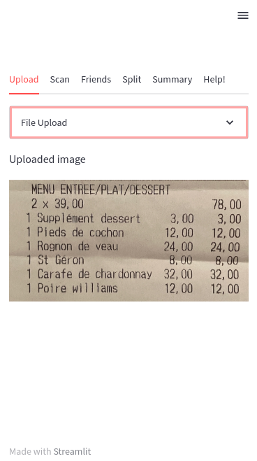
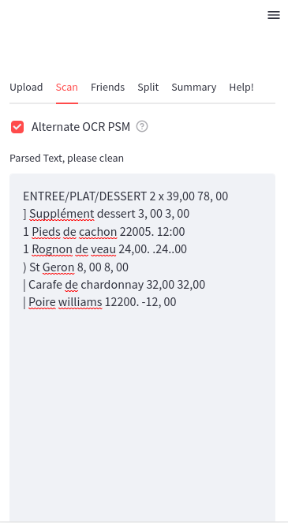
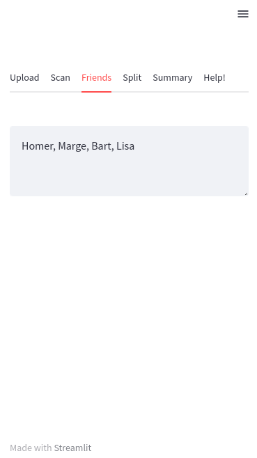
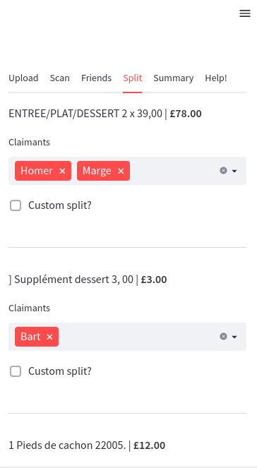
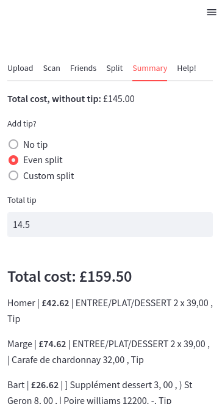

# 🧾 BillSplit 🔀

*Picture the scene...*

It's a Friday night. You're at dinner with all of your friends, you're having a great time. The bill arrives. With a sinking heart, you suddenly realise that **there are far too many items and far too many people - you'll never figure out who owes what!**

If this sounds like you, or someone you love - **you need BillSplit!** 

---

BillSplit... 
1) lets you upload a picture of your receipt,
2) uses OCR to **automatically** read in all the items, and 
3) then lets you split everything with your friends in whatever which way you want!

BillSplit is a (fairly mobile-friendly) streamlit app.

---

The Streamlit Cloud deployment of this app available [here](https://billsplit.streamlit.app/).

## Mobile Screenshots

<pre>
  

               
    
    
          
  

</pre>
